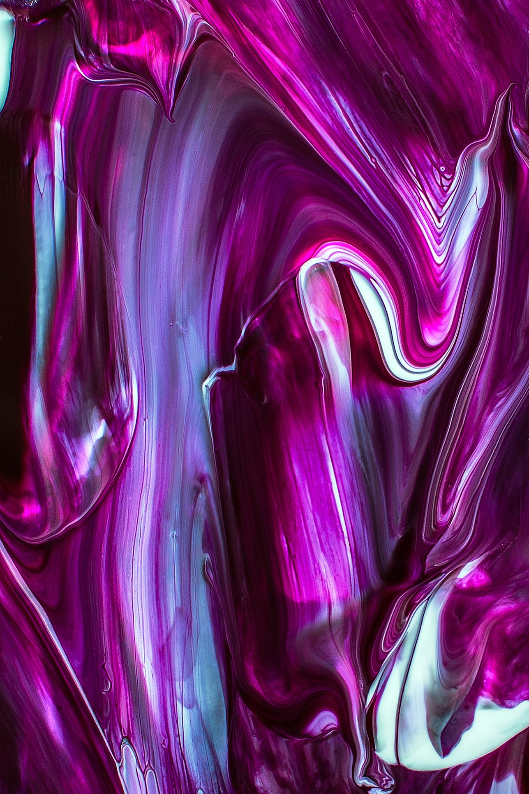

# Galerie Artistique | Portfolio Digital

## À propos du projet

**Galerie Artistique** est une expérience immersive d'art numérique que j'ai conçue et développée pour présenter mon savoir-faire en tant que designer UI/UX et développeur front-end. Ce projet fusionne mes passions pour l'art contemporain, les interactions utilisateur sophistiquées et le développement web moderne.

→ [Explorer la galerie en ligne](#) (coming soon)

## Ma vision créative

En tant que designer et développeur, je voulais créer une expérience qui transcende les frontières traditionnelles des galeries d'art en ligne. Mon objectif était de concevoir un espace numérique où la technologie n'est pas seulement un moyen de présentation, mais devient elle-même une forme d'expression artistique.

J'ai puisé mon inspiration dans les mouvements d'art numérique contemporain, ainsi que dans les principes du design minimaliste et des interactions fluides. Chaque élément de l'interface a été méticuleusement conçu pour encadrer l'art sans le dominer, créant ainsi un équilibre parfait entre contenu et présentation.

## Processus de design

Mon approche du design pour ce projet s'est déroulée en plusieurs phases :

1. **Recherche et exploration conceptuelle** : Étude des galeries d'art physiques et numériques, analyse des principes d'exposition d'art moderne.

2. **Design d'interaction** : Conception d'un parcours utilisateur qui imite la découverte progressive d'une exposition, avec des transitions fluides et une navigation intuitive.

3. **Prototypage UI** : Création de wireframes et de maquettes haute-fidélité, avec une attention particulière portée aux animations et à l'équilibre visuel.

4. **Tests utilisateurs** : Itérations du design basées sur les retours d'utilisateurs pour perfectionner l'expérience.

Les composants d'interface, tels que le curseur fluide et les boutons à effet liquide, ont été spécialement conçus pour ajouter une dimension tactile et organique à l'expérience numérique.

## Innovations techniques

J'ai relevé plusieurs défis techniques dans ce projet :

- **Animation du curseur personnalisé** : J'ai implémenté un système de curseur contextuel qui réagit au contenu et aux actions de l'utilisateur, créant une expérience immersive.

- **Animations réactives** : J'ai développé des animations qui réagissent au défilement et à la position de la souris, ajoutant une dimension de profondeur à l'interface.

- **Canvas génératif** : J'ai créé un système d'arrière-plan génératif qui évolue en fonction de l'œuvre sélectionnée, ajoutant une couche visuelle dynamique à l'expérience.

- **Optimisation des performances** : J'ai optimisé les animations et les transitions pour garantir une expérience fluide sur tous les appareils.

## Stack technologique

Pour réaliser ma vision, j'ai sélectionné un ensemble de technologies modernes :

- **Framework**: Next.js 15 avec React 19 (App Router)
- **Animations**: Framer Motion pour des transitions fluides et des animations complexes
- **Styling**: TailwindCSS pour un design responsive et cohérent
- **Interactivité**: Hooks personnalisés pour la gestion du contexte et des événements utilisateur
- **Composants UI**: Combinaison de Radix UI et de composants personnalisés pour une accessibilité optimale

## Ce que j'ai appris

Ce projet m'a permis d'approfondir mes compétences en :

- Conception d'interactions utilisateur avancées
- Animation d'interfaces avec Framer Motion
- Architecture d'applications React modernes avec Next.js
- Optimisation des performances d'applications riches en animations
- Développement d'expériences immersives cross-device

## La galerie en détail

La galerie présente actuellement cinq œuvres fictives que j'ai sélectionnées pour illustrer différentes techniques et esthétiques de l'art numérique contemporain :

1. **Métamorphose** - Une exploration de la transformation et du changement constant
2. **Rêves Digitaux** - Une fusion entre conscience humaine et réalité numérique
3. **Échos Quantiques** - Une visualisation de patterns quantiques invisibles
4. **Jardin Neural** - Une symbiose entre nature et intelligence artificielle
5. **Fragments Temporels** - Une perspective non-linéaire sur la mémoire et le temps

Chaque œuvre bénéficie d'une présentation détaillée avec des vues zoomables, des informations contextuelles et une exploration approfondie de ses caractéristiques.

## Prochaines évolutions

Ce projet continue d'évoluer, et je prévois d'y ajouter :

- Une section pour présenter de vrais artistes numériques contemporains
- Un mode VR pour explorer la galerie en réalité virtuelle
- Des fonctionnalités d'interaction sociale entre visiteurs
- Une API permettant aux artistes de soumettre leurs œuvres

## Me contacter

Je suis ouvert aux opportunités professionnelles et aux collaborations créatives. N'hésitez pas à me contacter :

- Email: andy.semariel.beugre@gmail.com
- Instagram: [@b.andysa](https://www.instagram.com/b.andysa/)
- LinkedIn: [Andy Semariel Beugré](#)

---

Ce projet a été conçu et développé par Andy Semariel Beugré. Tous droits réservés © 2024. 